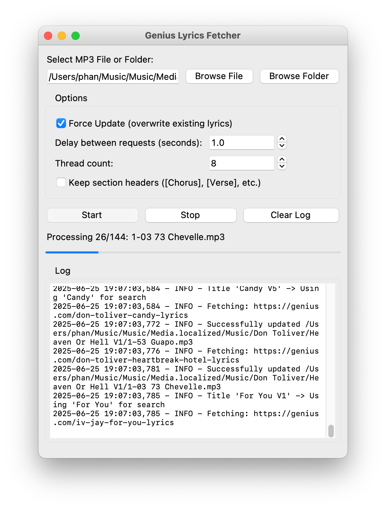

# py-genius-tag

A python tool to fetch and embed metadata from Genius.com to mp3 files

## Quick Start

```bash
# install dependencies
pip install -r requirements.txt

# run GUI (drag & drop interface)
python runner_gui.py

# or run CLI
python runner.py "/path/to/song.mp3"
```

## Requirements

- Python 3.7+
- `requests`
- `mutagen`
- `tkinterdnd2` (for drag-and-drop)

## Usage Examples

### GUI (Recommended)
```bash
python runner_gui.py
```
Simply drag and drop MP3 files or folders onto the interface.

### CLI
```bash
# single file
python runner.py "/path/to/song.mp3"

# entire folder
python runner.py "/path/to/music/folder"

# force update existing metadata
python runner.py "/path/to/folder" --force

# add delay between requests (rate limiting)
python runner.py "/path/to/folder" --delay 2.0
```

## Example Output

```
Found 3 MP3 file(s):
1. song1.mp3
2. song2.mp3
3. song3.mp3

==================================================
Processing: song1.mp3
==================================================

1. Fetching lyrics from Genius.com...
2. Embedding lyrics and year...
✅ Success! Updated: song1.mp3
```

## Screenshots

<p align="center">
  <table>
    <tr>
      <td align="center">
        <br>
        <em>App UI</em>
      </td>
      <td align="center">
        <br>
        <em>Lyrics in Music Player</em>
      </td>
    </tr>
  </table>
</p>
