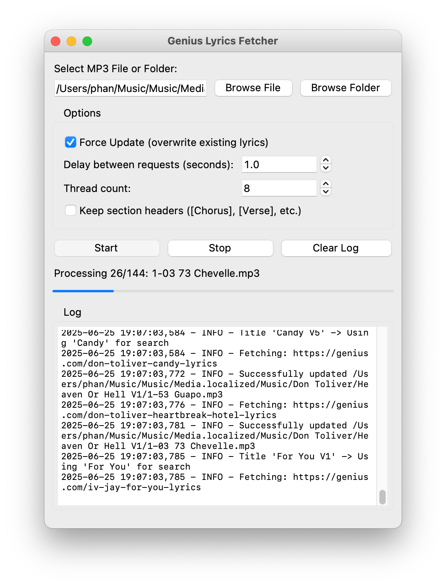

# Metadata Fetcher

A powerful, user-friendly batch tool for fetching and embedding lyrics and metadata into your MP3 files. It features a modern drag-and-drop GUI for macOS, multi-threaded processing, and robust Genius.com integration.

---

## 🚀 Download

**[⬇️ Download the latest Metadata Fetcher for macOS (.app)](https://github.com/00vqla/metadata-fetcher/releases/latest)**

- Download the `.zip` file from the [Releases page](https://github.com/00vqla/metadata-fetcher/releases).
- Unzip it and move `Metadata Fetcher.app` to your Applications folder.
- If you see a security warning, right-click the app and choose **Open** the first time.

---

## Features

- 🎵 **Batch Processing:** Process entire folders of MP3 files at once.
- 🔍 **Lyrics Extraction:** Fetch lyrics from Genius.com and embed them in MP3 tags.
- ⚡ **Multi-threaded:** Speed up processing with parallel threads.
- 🖱️ **Drag-and-Drop:** Easily select files or folders.
- 📝 **Section Formatting:** Option to keep or remove [Chorus], [Verse], etc.

---

## Installation (from source)

1. **Install Python 3.7+**
2. **Install dependencies:**
   ```bash
   pip install -r requirements.txt
   ```
   - For drag-and-drop support:
     ```bash
     pip install tkinterdnd2
     ```

## Usage

### Run the GUI

```bash
python3 genius_lyrics_gui_tkinter.py
```

- Select a file or folder, set your options, and click **Start**!

### Command-Line Usage

CLI processing:

```bash
python3 metadata_fetcher.py <path-to-mp3-or-folder>
```

**Examples:**

- Process a single MP3 file:
  ```bash
  python3 metadata_fetcher.py "/path/to/song.mp3"
  ```
- Process all MP3 files in a folder:
  ```bash
  python3 metadata_fetcher.py "/path/to/music/folder"
  ```
- Force update (overwrite existing lyrics):
  ```bash
  python3 metadata_fetcher.py "/path/to/folder" --force
  ```
- Set a custom delay between requests (in seconds):
  ```bash
  python3 metadata_fetcher.py "/path/to/folder" --delay 2.0
  ```

## Configuration

- **Thread Count:** Set how many files to process in parallel (GUI only).
- **Delay:** Set a delay between requests to avoid being blocked by Genius.com.
- **Section Headers:** Choose whether to keep or remove [Chorus], [Verse], etc.

<p align="center">
  
</p>

<p align="center">
  
  <br>
  <em>Example: Lyrics displayed in a music player after using Metadata Fetcher.</em>
</p>

## Requirements

- Python 3.7+
- `requests`
- `mutagen`
- `tkinterdnd2` (for drag-and-drop)

## License

© 2025 vq vault.